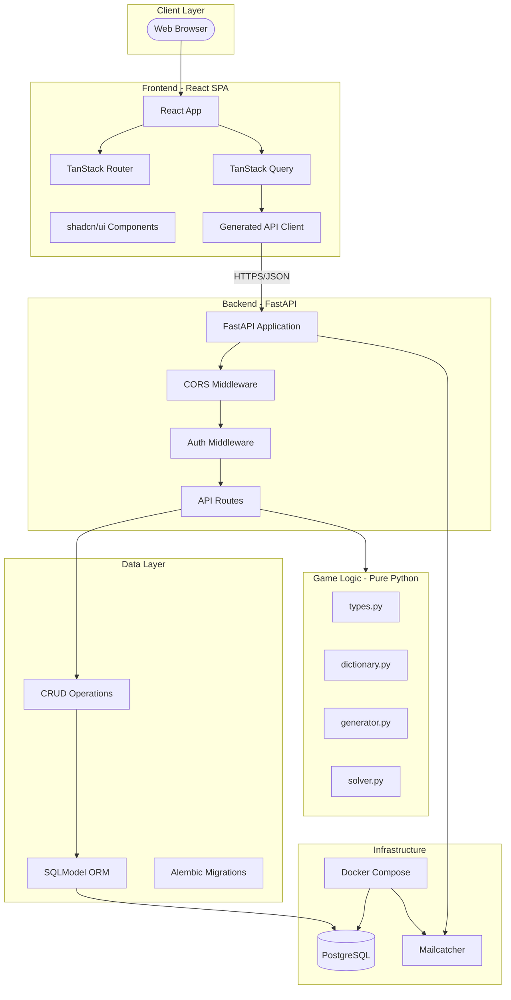

# System Architecture Overview

High-level view of all system components and their relationships.

```mermaid
flowchart TB
    subgraph Client["Client Layer"]
        Browser([Web Browser])
    end

    subgraph Frontend["Frontend - React SPA"]
        ReactApp[React App]
        TanStackRouter[TanStack Router]
        TanStackQuery[TanStack Query]
        ShadcnUI[shadcn/ui Components]
        APIClient[Generated API Client]
    end

    subgraph Backend["Backend - FastAPI"]
        FastAPIApp[FastAPI Application]
        APIRoutes[API Routes]
        AuthMiddleware[Auth Middleware]
        CORS[CORS Middleware]
    end

    subgraph GameLogic["Game Logic - Pure Python"]
        GameTypes[types.py]
        Dictionary[dictionary.py]
        Generator[generator.py]
        Solver[solver.py]
    end

    subgraph DataLayer["Data Layer"]
        SQLModel[SQLModel ORM]
        CRUD[CRUD Operations]
        Alembic[Alembic Migrations]
    end

    subgraph Infrastructure["Infrastructure"]
        PostgreSQL[(PostgreSQL)]
        Docker[Docker Compose]
        Mailcatcher[Mailcatcher]
    end

    Browser --> ReactApp
    ReactApp --> TanStackRouter
    ReactApp --> TanStackQuery
    TanStackQuery --> APIClient
    APIClient -->|HTTPS/JSON| FastAPIApp
    FastAPIApp --> CORS
    CORS --> AuthMiddleware
    AuthMiddleware --> APIRoutes
    APIRoutes --> GameLogic
    APIRoutes --> CRUD
    CRUD --> SQLModel
    SQLModel --> PostgreSQL
    Docker --> PostgreSQL
    Docker --> Mailcatcher
    FastAPIApp --> Mailcatcher
```

[Back to SPEC](../SPEC.md#architecture-diagrams)
