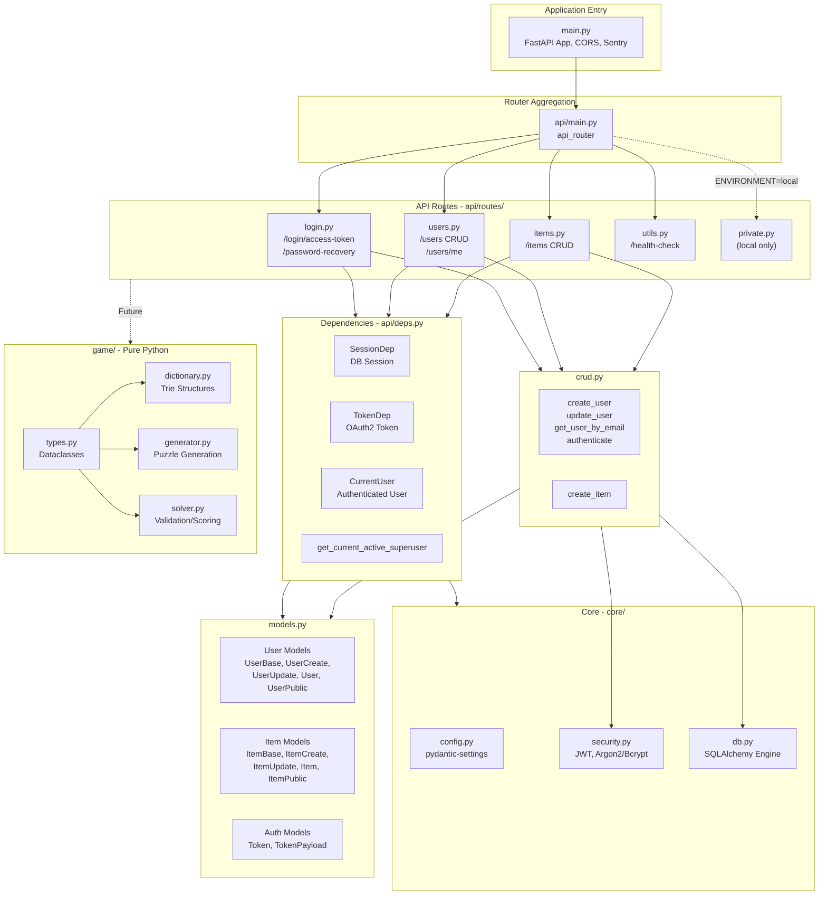

# Backend Layer Architecture

Detailed view of the FastAPI backend structure and dependencies.

```mermaid
flowchart TB
    subgraph EntryPoint["Application Entry"]
        MainPy["main.py<br/>FastAPI App, CORS, Sentry"]
    end

    subgraph RouterAggregation["Router Aggregation"]
        APIMain["api/main.py<br/>api_router"]
    end

    subgraph Routes["API Routes - api/routes/"]
        LoginRouter["login.py<br/>/login/access-token<br/>/password-recovery"]
        UsersRouter["users.py<br/>/users CRUD<br/>/users/me"]
        ItemsRouter["items.py<br/>/items CRUD"]
        UtilsRouter["utils.py<br/>/health-check"]
        PrivateRouter["private.py<br/>(local only)"]
    end

    subgraph Dependencies["Dependencies - api/deps.py"]
        SessionDep["SessionDep<br/>DB Session"]
        TokenDep["TokenDep<br/>OAuth2 Token"]
        CurrentUser["CurrentUser<br/>Authenticated User"]
        SuperuserDep["get_current_active_superuser"]
    end

    subgraph Core["Core - core/"]
        Config["config.py<br/>pydantic-settings"]
        Security["security.py<br/>JWT, Argon2/Bcrypt"]
        DB["db.py<br/>SQLAlchemy Engine"]
    end

    subgraph Models["models.py"]
        UserModels["User Models<br/>UserBase, UserCreate,<br/>UserUpdate, User, UserPublic"]
        ItemModels["Item Models<br/>ItemBase, ItemCreate,<br/>ItemUpdate, Item, ItemPublic"]
        AuthModels["Auth Models<br/>Token, TokenPayload"]
    end

    subgraph CRUDLayer["crud.py"]
        UserCRUD["create_user<br/>update_user<br/>get_user_by_email<br/>authenticate"]
        ItemCRUD["create_item"]
    end

    subgraph GameModule["game/ - Pure Python"]
        Types["types.py<br/>Dataclasses"]
        Dict["dictionary.py<br/>Trie Structures"]
        Gen["generator.py<br/>Puzzle Generation"]
        Solve["solver.py<br/>Validation/Scoring"]
    end

    MainPy --> APIMain
    APIMain --> LoginRouter
    APIMain --> UsersRouter
    APIMain --> ItemsRouter
    APIMain --> UtilsRouter
    APIMain -.->|ENVIRONMENT=local| PrivateRouter

    LoginRouter --> Dependencies
    UsersRouter --> Dependencies
    ItemsRouter --> Dependencies

    Dependencies --> Core
    Dependencies --> Models

    LoginRouter --> CRUDLayer
    UsersRouter --> CRUDLayer
    ItemsRouter --> CRUDLayer

    CRUDLayer --> Models
    CRUDLayer --> Security
    CRUDLayer --> DB

    Routes -.->|Future| GameModule
    Types --> Dict
    Types --> Gen
    Types --> Solve
```

[Back to SPEC](../SPEC.md#architecture-diagrams)
