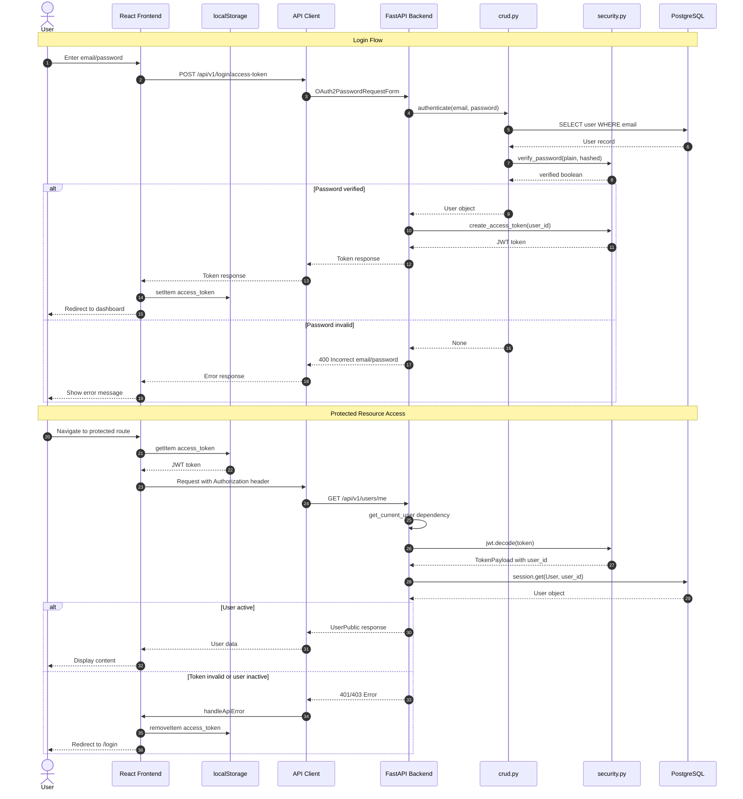

# Authentication Flow

Complete JWT authentication flow from login to protected resource access.

```mermaid
sequenceDiagram
    autonumber
    actor User
    participant Frontend as React Frontend
    participant LocalStorage as localStorage
    participant APIClient as API Client
    participant Backend as FastAPI Backend
    participant CRUD as crud.py
    participant Security as security.py
    participant DB as PostgreSQL

    Note over User,DB: Login Flow
    User->>Frontend: Enter email/password
    Frontend->>APIClient: POST /api/v1/login/access-token
    APIClient->>Backend: OAuth2PasswordRequestForm
    Backend->>CRUD: authenticate(email, password)
    CRUD->>DB: SELECT user WHERE email
    DB-->>CRUD: User record
    CRUD->>Security: verify_password(plain, hashed)
    Security-->>CRUD: verified boolean
    alt Password verified
        CRUD-->>Backend: User object
        Backend->>Security: create_access_token(user_id)
        Security-->>Backend: JWT token
        Backend-->>APIClient: Token response
        APIClient-->>Frontend: Token response
        Frontend->>LocalStorage: setItem access_token
        Frontend-->>User: Redirect to dashboard
    else Password invalid
        CRUD-->>Backend: None
        Backend-->>APIClient: 400 Incorrect email/password
        APIClient-->>Frontend: Error response
        Frontend-->>User: Show error message
    end

    Note over User,DB: Protected Resource Access
    User->>Frontend: Navigate to protected route
    Frontend->>LocalStorage: getItem access_token
    LocalStorage-->>Frontend: JWT token
    Frontend->>APIClient: Request with Authorization header
    APIClient->>Backend: GET /api/v1/users/me
    Backend->>Backend: get_current_user dependency
    Backend->>Security: jwt.decode(token)
    Security-->>Backend: TokenPayload with user_id
    Backend->>DB: session.get(User, user_id)
    DB-->>Backend: User object
    alt User active
        Backend-->>APIClient: UserPublic response
        APIClient-->>Frontend: User data
        Frontend-->>User: Display content
    else Token invalid or user inactive
        Backend-->>APIClient: 401/403 Error
        APIClient->>Frontend: handleApiError
        Frontend->>LocalStorage: removeItem access_token
        Frontend-->>User: Redirect to /login
    end
```

[Back to SPEC](../SPEC.md#architecture-diagrams)
