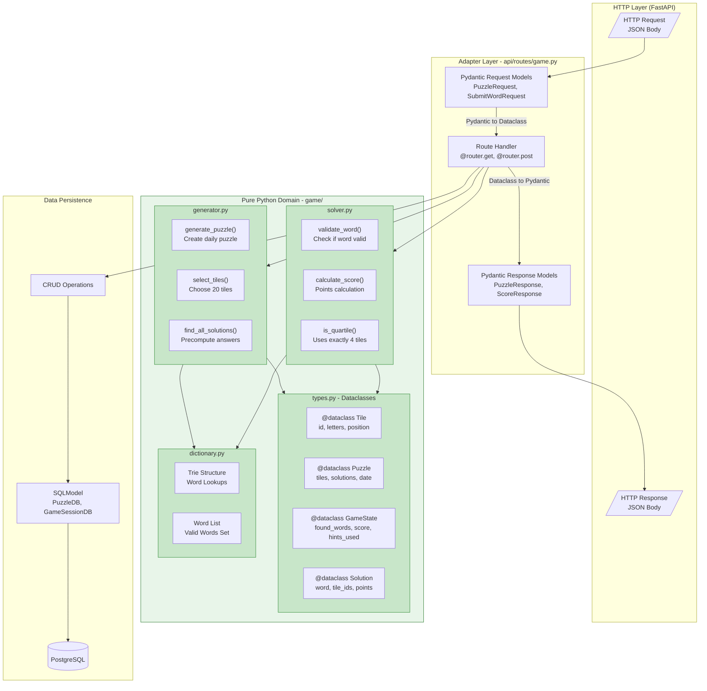

# Game Domain Architecture

Clean separation between pure Python game logic and the web framework adapter layer.

```mermaid
flowchart TB
    subgraph HTTPLayer["HTTP Layer (FastAPI)"]
        Request[/"HTTP Request<br/>JSON Body"/]
        Response[/"HTTP Response<br/>JSON Body"/]
    end

    subgraph AdapterLayer["Adapter Layer - api/routes/game.py"]
        PydanticReq["Pydantic Request Models<br/>PuzzleRequest, SubmitWordRequest"]
        RouteHandler["Route Handler<br/>@router.get, @router.post"]
        PydanticRes["Pydantic Response Models<br/>PuzzleResponse, ScoreResponse"]
    end

    subgraph GameDomain["Pure Python Domain - game/"]
        direction TB
        subgraph Types["types.py - Dataclasses"]
            Tile["@dataclass Tile<br/>id, letters, position"]
            Puzzle["@dataclass Puzzle<br/>tiles, solutions, date"]
            GameState["@dataclass GameState<br/>found_words, score, hints_used"]
            Solution["@dataclass Solution<br/>word, tile_ids, points"]
        end

        subgraph DictionaryMod["dictionary.py"]
            Trie["Trie Structure<br/>Word Lookups"]
            WordList["Word List<br/>Valid Words Set"]
        end

        subgraph GeneratorMod["generator.py"]
            GeneratePuzzle["generate_puzzle()<br/>Create daily puzzle"]
            SelectTiles["select_tiles()<br/>Choose 20 tiles"]
            FindSolutions["find_all_solutions()<br/>Precompute answers"]
        end

        subgraph SolverMod["solver.py"]
            ValidateWord["validate_word()<br/>Check if word valid"]
            CalculateScore["calculate_score()<br/>Points calculation"]
            CheckQuartile["is_quartile()<br/>Uses exactly 4 tiles"]
        end
    end

    subgraph DataLayer["Data Persistence"]
        SQLModels["SQLModel<br/>PuzzleDB, GameSessionDB"]
        CRUDOps["CRUD Operations"]
        Database[(PostgreSQL)]
    end

    Request --> PydanticReq
    PydanticReq -->|"Pydantic to Dataclass"| RouteHandler
    RouteHandler --> GeneratorMod
    RouteHandler --> SolverMod
    GeneratorMod --> DictionaryMod
    GeneratorMod --> Types
    SolverMod --> DictionaryMod
    SolverMod --> Types
    RouteHandler --> CRUDOps
    CRUDOps --> SQLModels
    SQLModels --> Database
    RouteHandler -->|"Dataclass to Pydantic"| PydanticRes
    PydanticRes --> Response

    style GameDomain fill:#e8f5e9,stroke:#2e7d32
    style Types fill:#c8e6c9,stroke:#388e3c
    style DictionaryMod fill:#c8e6c9,stroke:#388e3c
    style GeneratorMod fill:#c8e6c9,stroke:#388e3c
    style SolverMod fill:#c8e6c9,stroke:#388e3c
```

[Back to SPEC](../SPEC.md#architecture-diagrams)
