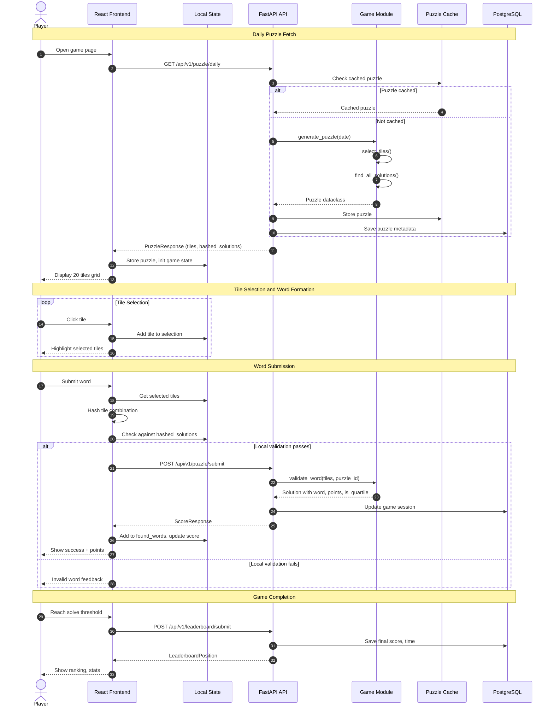

# Data Flow for Game Play

End-to-end flow for playing a Quartiles puzzle.

```mermaid
sequenceDiagram
    autonumber
    actor Player
    participant Frontend as React Frontend
    participant LocalState as Local State
    participant API as FastAPI API
    participant Game as Game Module
    participant Cache as Puzzle Cache
    participant DB as PostgreSQL

    Note over Player,DB: Daily Puzzle Fetch
    Player->>Frontend: Open game page
    Frontend->>API: GET /api/v1/puzzle/daily
    API->>Cache: Check cached puzzle
    alt Puzzle cached
        Cache-->>API: Cached puzzle
    else Not cached
        API->>Game: generate_puzzle(date)
        Game->>Game: select_tiles()
        Game->>Game: find_all_solutions()
        Game-->>API: Puzzle dataclass
        API->>Cache: Store puzzle
        API->>DB: Save puzzle metadata
    end
    API-->>Frontend: PuzzleResponse (tiles, hashed_solutions)
    Frontend->>LocalState: Store puzzle, init game state
    Frontend-->>Player: Display 20 tiles grid

    Note over Player,DB: Tile Selection and Word Formation
    loop Tile Selection
        Player->>Frontend: Click tile
        Frontend->>LocalState: Add tile to selection
        Frontend-->>Player: Highlight selected tiles
    end

    Note over Player,DB: Word Submission
    Player->>Frontend: Submit word
    Frontend->>LocalState: Get selected tiles
    Frontend->>Frontend: Hash tile combination
    Frontend->>LocalState: Check against hashed_solutions
    alt Local validation passes
        Frontend->>API: POST /api/v1/puzzle/submit
        API->>Game: validate_word(tiles, puzzle_id)
        Game-->>API: Solution with word, points, is_quartile
        API->>DB: Update game session
        API-->>Frontend: ScoreResponse
        Frontend->>LocalState: Add to found_words, update score
        Frontend-->>Player: Show success + points
    else Local validation fails
        Frontend-->>Player: Invalid word feedback
    end

    Note over Player,DB: Game Completion
    Player->>Frontend: Reach solve threshold
    Frontend->>API: POST /api/v1/leaderboard/submit
    API->>DB: Save final score, time
    API-->>Frontend: LeaderboardPosition
    Frontend-->>Player: Show ranking, stats
```

[Back to SPEC](../SPEC.md#architecture-diagrams)
