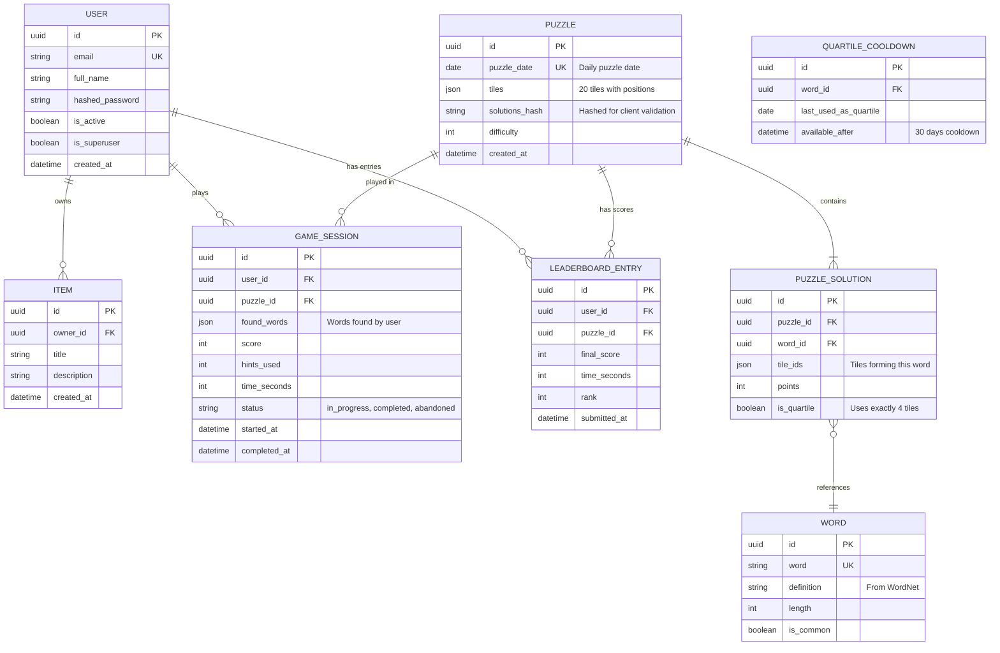

# Database Entity Relationships

Current and planned database schema.

```mermaid
erDiagram
    USER ||--o{ ITEM : owns
    USER ||--o{ GAME_SESSION : plays
    USER ||--o{ LEADERBOARD_ENTRY : "has entries"
    PUZZLE ||--o{ GAME_SESSION : "played in"
    PUZZLE ||--o{ LEADERBOARD_ENTRY : "has scores"
    PUZZLE ||--|{ PUZZLE_SOLUTION : contains
    PUZZLE_SOLUTION }o--|| WORD : references

    USER {
        uuid id PK
        string email UK
        string full_name
        string hashed_password
        boolean is_active
        boolean is_superuser
        datetime created_at
    }

    ITEM {
        uuid id PK
        uuid owner_id FK
        string title
        string description
        datetime created_at
    }

    PUZZLE {
        uuid id PK
        date puzzle_date UK "Daily puzzle date"
        json tiles "20 tiles with positions"
        string solutions_hash "Hashed for client validation"
        int difficulty
        datetime created_at
    }

    PUZZLE_SOLUTION {
        uuid id PK
        uuid puzzle_id FK
        uuid word_id FK
        json tile_ids "Tiles forming this word"
        int points
        boolean is_quartile "Uses exactly 4 tiles"
    }

    WORD {
        uuid id PK
        string word UK
        string definition "From WordNet"
        int length
        boolean is_common
    }

    GAME_SESSION {
        uuid id PK
        uuid user_id FK
        uuid puzzle_id FK
        json found_words "Words found by user"
        int score
        int hints_used
        int time_seconds
        string status "in_progress, completed, abandoned"
        datetime started_at
        datetime completed_at
    }

    LEADERBOARD_ENTRY {
        uuid id PK
        uuid user_id FK
        uuid puzzle_id FK
        int final_score
        int time_seconds
        int rank
        datetime submitted_at
    }

    QUARTILE_COOLDOWN {
        uuid id PK
        uuid word_id FK
        date last_used_as_quartile
        datetime available_after "30 days cooldown"
    }
```

[Back to SPEC](../SPEC.md#architecture-diagrams)
