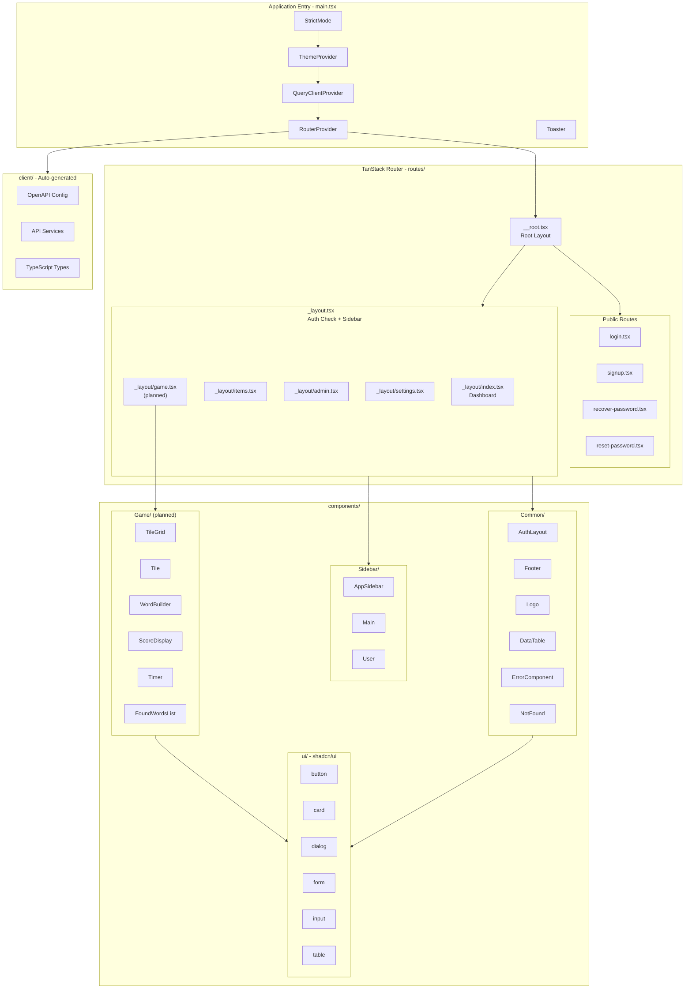

# Frontend Component Architecture

React component hierarchy and routing structure.

```mermaid
flowchart TB
    subgraph Entry["Application Entry - main.tsx"]
        StrictMode[StrictMode]
        ThemeProvider[ThemeProvider]
        QueryClientProvider[QueryClientProvider]
        RouterProvider[RouterProvider]
        Toaster[Toaster]
    end

    subgraph Routing["TanStack Router - routes/"]
        RootRoute["__root.tsx<br/>Root Layout"]
        subgraph PublicRoutes["Public Routes"]
            Login["login.tsx"]
            Signup["signup.tsx"]
            RecoverPwd["recover-password.tsx"]
            ResetPwd["reset-password.tsx"]
        end
        subgraph ProtectedLayout["_layout.tsx<br/>Auth Check + Sidebar"]
            LayoutIndex["_layout/index.tsx<br/>Dashboard"]
            Items["_layout/items.tsx"]
            Admin["_layout/admin.tsx"]
            Settings["_layout/settings.tsx"]
            GameRoute["_layout/game.tsx<br/>(planned)"]
        end
    end

    subgraph Components["components/"]
        subgraph Common["Common/"]
            AuthLayout[AuthLayout]
            Footer[Footer]
            Logo[Logo]
            DataTable[DataTable]
            ErrorComponent[ErrorComponent]
            NotFound[NotFound]
        end

        subgraph Sidebar["Sidebar/"]
            AppSidebar[AppSidebar]
            SidebarMain[Main]
            SidebarUser[User]
        end

        subgraph GameComponents["Game/ (planned)"]
            TileGrid[TileGrid]
            Tile[Tile]
            WordBuilder[WordBuilder]
            ScoreDisplay[ScoreDisplay]
            Timer[Timer]
            FoundWordsList[FoundWordsList]
        end

        subgraph UI["ui/ - shadcn/ui"]
            Button[button]
            Card[card]
            Dialog[dialog]
            Form[form]
            Input[input]
            Table[table]
        end
    end

    subgraph Client["client/ - Auto-generated"]
        OpenAPI[OpenAPI Config]
        Services[API Services]
        TypesTS[TypeScript Types]
    end

    StrictMode --> ThemeProvider
    ThemeProvider --> QueryClientProvider
    QueryClientProvider --> RouterProvider
    RouterProvider --> RootRoute

    RootRoute --> PublicRoutes
    RootRoute --> ProtectedLayout

    ProtectedLayout --> Sidebar
    ProtectedLayout --> Common

    GameRoute --> GameComponents
    GameComponents --> UI
    Common --> UI

    RouterProvider --> Client
```

[Back to SPEC](../SPEC.md#architecture-diagrams)
