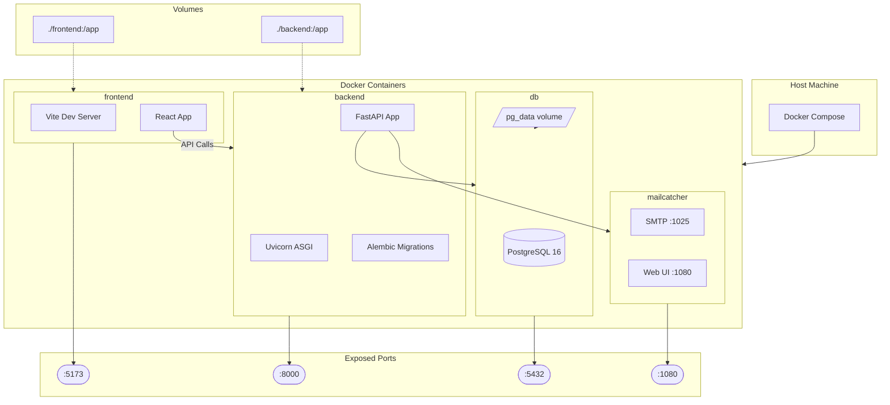

# Deployment Architecture

Docker Compose orchestration and service relationships.

```mermaid
flowchart TB
    subgraph Host["Host Machine"]
        DockerCompose[Docker Compose]
    end

    subgraph Containers["Docker Containers"]
        subgraph FrontendContainer["frontend"]
            Vite[Vite Dev Server]
            ReactBuild[React App]
        end

        subgraph BackendContainer["backend"]
            Uvicorn[Uvicorn ASGI]
            FastAPI[FastAPI App]
            AlembicMig[Alembic Migrations]
        end

        subgraph DBContainer["db"]
            PostgreSQL[(PostgreSQL 16)]
            PGData[/pg_data volume/]
        end

        subgraph MailContainer["mailcatcher"]
            SMTP[SMTP :1025]
            WebUI[Web UI :1080]
        end
    end

    subgraph Ports["Exposed Ports"]
        Port5173([":5173"])
        Port8000([":8000"])
        Port5432([":5432"])
        Port1080([":1080"])
    end

    subgraph Volumes["Volumes"]
        AppVolume[./backend:/app]
        FrontendVolume[./frontend:/app]
    end

    DockerCompose --> Containers

    FrontendContainer --> Port5173
    BackendContainer --> Port8000
    DBContainer --> Port5432
    MailContainer --> Port1080

    ReactBuild -->|API Calls| BackendContainer
    FastAPI --> DBContainer
    FastAPI --> MailContainer

    AppVolume -.-> BackendContainer
    FrontendVolume -.-> FrontendContainer
    PGData -.-> DBContainer
```

[Back to SPEC](../SPEC.md#architecture-diagrams)
