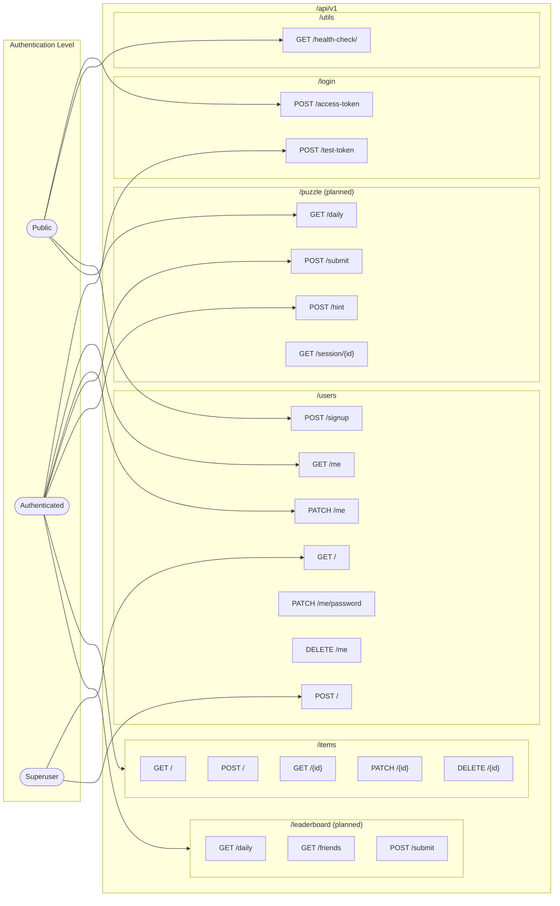

# API Route Structure

Complete API endpoint hierarchy with planned game routes.

```mermaid
flowchart LR
    subgraph APIPrefix["/api/v1"]
        subgraph LoginRoutes["/login"]
            AccessToken["POST /access-token"]
            TestToken["POST /test-token"]
        end

        subgraph UserRoutes["/users"]
            ListUsers["GET /"]
            CreateUser["POST /"]
            GetMe["GET /me"]
            UpdateMe["PATCH /me"]
            UpdatePassword["PATCH /me/password"]
            DeleteMe["DELETE /me"]
            Signup["POST /signup"]
        end

        subgraph ItemRoutes["/items"]
            ListItems["GET /"]
            CreateItem["POST /"]
            GetItem["GET /{id}"]
            UpdateItem["PATCH /{id}"]
            DeleteItem["DELETE /{id}"]
        end

        subgraph PuzzleRoutes["/puzzle (planned)"]
            GetDaily["GET /daily"]
            SubmitWord["POST /submit"]
            GetHint["POST /hint"]
            GetSession["GET /session/{id}"]
        end

        subgraph LeaderboardRoutes["/leaderboard (planned)"]
            GetDaily2["GET /daily"]
            GetFriends["GET /friends"]
            SubmitScore["POST /submit"]
        end

        subgraph UtilRoutes["/utils"]
            HealthCheck["GET /health-check/"]
        end
    end

    subgraph Auth["Authentication Level"]
        Public([Public])
        Authenticated([Authenticated])
        Superuser([Superuser])
    end

    Public --> AccessToken
    Public --> HealthCheck
    Public --> Signup
    Public --> GetDaily

    Authenticated --> TestToken
    Authenticated --> GetMe
    Authenticated --> UpdateMe
    Authenticated --> ItemRoutes
    Authenticated --> SubmitWord
    Authenticated --> GetHint
    Authenticated --> LeaderboardRoutes

    Superuser --> ListUsers
    Superuser --> CreateUser
```

[Back to SPEC](../SPEC.md#architecture-diagrams)
