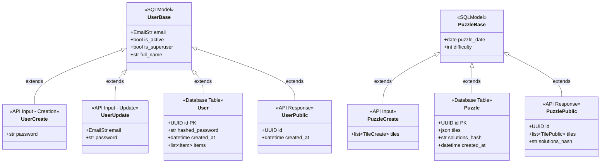

# Model Schema Pattern

The naming convention and inheritance pattern for SQLModel schemas.

```mermaid
classDiagram
    class UserBase {
        <<SQLModel>>
        +EmailStr email
        +bool is_active
        +bool is_superuser
        +str full_name
    }

    class UserCreate {
        <<API Input - Creation>>
        +str password
    }

    class UserUpdate {
        <<API Input - Update>>
        +EmailStr email
        +str password
    }

    class User {
        <<Database Table>>
        +UUID id PK
        +str hashed_password
        +datetime created_at
        +list~Item~ items
    }

    class UserPublic {
        <<API Response>>
        +UUID id
        +datetime created_at
    }

    UserBase <|-- UserCreate : extends
    UserBase <|-- UserUpdate : extends
    UserBase <|-- User : extends
    UserBase <|-- UserPublic : extends

    class PuzzleBase {
        <<SQLModel>>
        +date puzzle_date
        +int difficulty
    }

    class PuzzleCreate {
        <<API Input>>
        +list~TileCreate~ tiles
    }

    class Puzzle {
        <<Database Table>>
        +UUID id PK
        +json tiles
        +str solutions_hash
        +datetime created_at
    }

    class PuzzlePublic {
        <<API Response>>
        +UUID id
        +list~TilePublic~ tiles
        +str solutions_hash
    }

    PuzzleBase <|-- PuzzleCreate : extends
    PuzzleBase <|-- Puzzle : extends
    PuzzleBase <|-- PuzzlePublic : extends
```

[Back to SPEC](../SPEC.md#architecture-diagrams)
